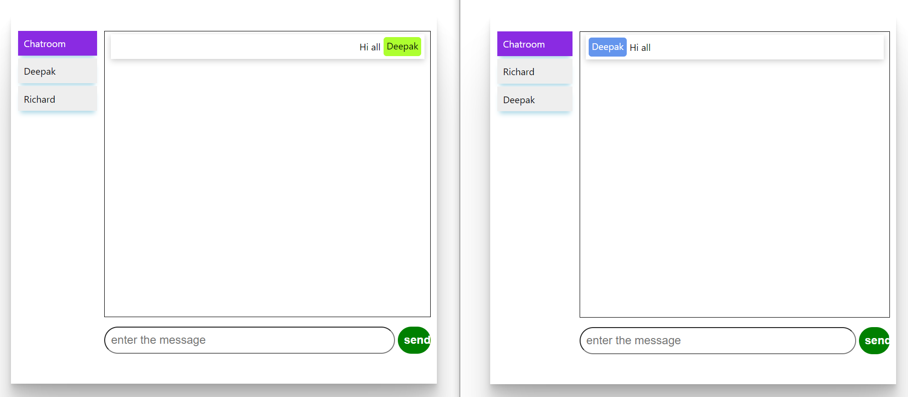
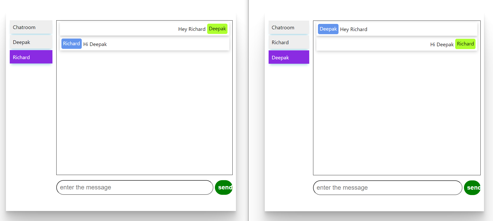

# Chat Room

## General Info

> A robust TCP/IP based real-time chat application with the functionality chat with multiple users at once.

## Tools and Technologies used

1. <b>Front-end </b> : React.js 
2. <b>Back-end </b> :- Spring Boot, SockJS

### Demo

